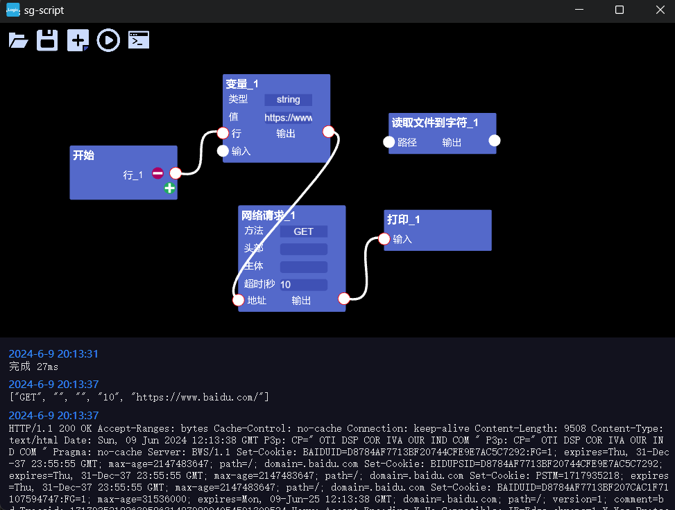

### 简单的节点脚本
个人业余小玩意，为什么不用块的形式？(这个做起来简单)
```
npm i
npm run dev
```
 _编辑器 ts+pixijs，执行器 rust_ 

##### 使用
编辑器导出 .sgs 文件，执行sgs-vm my-script.sgs
sgs-vm默认在应用目录下bin/

##### 计划
- [x] 代码编辑器
- [x] rust执行器，待完善
- [ ] electron包装
##### 截图
